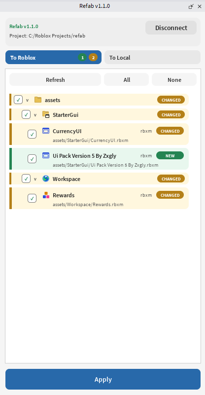
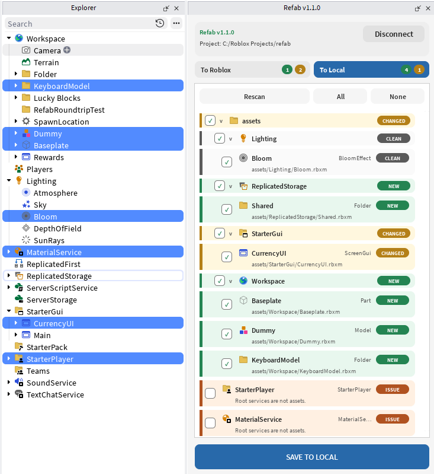

# Refab

Refab is a Roblox asset manager for syncing Studio Instances with local files.

Refab is built for teams that keep Roblox code in Rojo, but still need a clean
way to manage scene objects, UI, models, and other Studio-built assets outside
the place file.

## Table Of Contents

- [Workflow](#workflow)
- [Sync To Roblox](#sync-to-roblox)
- [Sync To Local](#sync-to-local)
- [Refab CLI](#refab-cli)
- [Asset Scope](#asset-scope)
- [Install](#install)
- [For Developers](#for-developers)

## Workflow

Refab uses a simple folder convention:

```text
assets/
  Workspace/
    World/
      Boat.rbxm
  StarterGui/
    Inventory.rbxm
  ReplicatedStorage/
    Items/
      Sword.rbxm
  ServerStorage/
    Drops/
      RewardChest.rbxm
  MaterialService/
    StylizedMetal.rbxm
```

Those files map directly back into Roblox:

```text
assets/Workspace/World/Boat.rbxm          -> Workspace.World.Boat
assets/StarterGui/Inventory.rbxm          -> StarterGui.Inventory
assets/ReplicatedStorage/Items/Sword.rbxm -> ReplicatedStorage.Items.Sword
assets/ServerStorage/Drops/RewardChest.rbxm -> ServerStorage.Drops.RewardChest
```

The path is the identity. There is no manifest file to merge or maintain.

Rojo remains the owner of project source code under folders like `src/client`,
`src/server`, and `src/shared`. Refab manages serialized Studio asset files; if
a Roblox asset package contains scripts as part of that asset, they stay inside
the serialized `.rbxm`/`.rbxmx`.

## Sync To Roblox

Use this when local asset files should update the open place.

<p align="center">
  
</p>

1. Run `refab run` in your project folder.
2. Open Roblox Studio.
3. Open the Refab plugin.
4. Use `To Roblox`.
5. Review new and changed assets in the tree.
6. Select the assets or folders you want.
7. Click `Apply`.

Changed assets replace the matching Instance with the same folder path and name.
New assets are inserted into the matching Roblox service.

## Sync To Local

Use this when selected Studio Instances should become local asset files.

<p align="center">
  
</p>

1. Select Instances in Explorer.
2. Open the Refab plugin.
3. Use `To Local`.
4. Review the selected asset tree.
5. Select the assets or folders you want.
6. Click `SAVE TO LOCAL`.

Refab writes the selected Instance tree into `assets/<Service>/...`.

## Refab CLI

Run it from your Roblox project root:

```powershell
refab run
```

During development, you can also run it with Cargo:

```powershell
cargo run --manifest-path cli/Cargo.toml -- run
```

The CLI lets the Studio plugin scan, compare, read, and write local asset files:

- scan `assets/**/*.rbxm`
- compare local files with open Studio Instances
- write selected Studio content back to `assets/`

## Asset Scope

Refab is organized around serializable asset content, not game logic.

| Asset/content type | Export | Import | Git | Destination | Preserved references |
| --- | --- | --- | --- | --- | --- |
| Workspace/world assets | Yes | Yes | Yes | `Workspace` | attributes, tags, instance refs, asset ids |
| Models, props, items, vehicles, characters | Yes | Yes | Yes | Any supported root | hierarchy, pivots, constraints, meshes, textures |
| ReplicatedStorage assets | Yes | Yes | Yes | `ReplicatedStorage` | attributes, tags, instance refs, asset ids |
| ServerStorage assets | Yes | Yes | Yes | `ServerStorage` | attributes, tags, private server-side asset refs |
| StarterGui UI | Yes | Yes | Yes | `StarterGui` | images, fonts, attributes, tags |
| StarterPack assets | Yes | Yes | Yes | `StarterPack` | tools, meshes, textures, sounds, animations |
| StarterPlayer content | Yes | Yes | Yes | `StarterPlayer` | character content, humanoid descriptions, visual refs |
| MeshParts and model hierarchies | Yes | Yes | Yes | Any supported root | mesh ids, texture ids, hierarchy, attributes |
| VFX, ParticleEmitters, Beams | Yes | Yes | Yes | Any supported root | texture ids, attachments, sequences |
| Audio, images, decals, textures | Yes | Yes | Yes | Any supported root | `SoundId`, `Texture`, `Image`, content ids |
| Animation references | Yes | Yes | Yes | Any supported root | `AnimationId`, rig/model references |
| Materials and visual assets | Yes | Yes | Yes | `MaterialService` or supported root | material variants, texture ids |
| Lighting visual content | Yes | Yes | Yes | `Lighting` | sky, atmosphere, post effects |
| Packages where applicable | Yes | Yes | Yes | Any supported root | package links and package ids |
| RBXM / RBXMX files | Yes | Yes | Yes | Path-derived Roblox target | serialized instance data |

Supported root folders:

- `Workspace`
- `ReplicatedStorage`
- `ServerStorage`
- `StarterGui`
- `StarterPack`
- `StarterPlayer`
- `Lighting`
- `SoundService`
- `MaterialService`

Files under unsupported roots, such as `assets/Scene/...`, are shown as errors
because Roblox has no matching top-level `Scene` service.

Keep controllers, services, and source modules in Rojo-managed code folders.
Refab is for serialized Studio content under `assets/`, not source folders.

## Install

Install the Roblox Studio plugin and the Refab CLI.

### Rokit

Add Refab to `rokit.toml`:

```toml
[tools]
refab = "stupeak/refab@1.1.2"
```

Then install it:

```powershell
rokit install
```

Install or update the local Roblox Studio plugin:

```powershell
refab install-plugin
```

Restart Roblox Studio after installing or updating the plugin.

### Manual

You can also download release files directly:

- `Refab.rbxm`
- the Refab CLI archive for your platform

Copy `Refab.rbxm` into your local Roblox plugins folder, then put the CLI binary
somewhere on your `PATH`.

Start Refab from your Roblox project root:

```powershell
refab run
```

## For Developers

Development notes live outside this user README:

- `AGENTS.md`
- `plugin/README.md`
- `cli/README.md`
