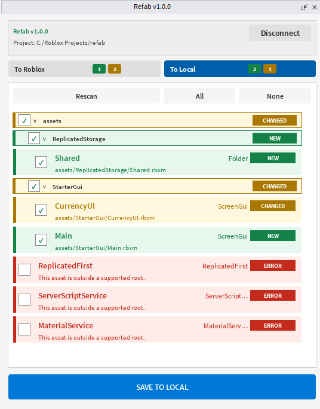

# Refab

Refab is a Roblox asset manager for syncing Studio Instances with local files.

<p align="center">
  
</p>

Refab is built for teams that keep Roblox code in Rojo, but still need a clean
way to manage scene objects, UI, models, and other Studio-built assets outside
the place file.

## Workflow

Refab uses a simple folder convention:

```text
assets/
  Workspace/
    World/
      Boat.rbxm
  StarterGui/
    Inventory.rbxm
  ReplicatedStorage/
    Items/
      Sword.rbxm
```

Those files map directly back into Roblox:

```text
assets/Workspace/World/Boat.rbxm          -> Workspace.World.Boat
assets/StarterGui/Inventory.rbxm          -> StarterGui.Inventory
assets/ReplicatedStorage/Items/Sword.rbxm -> ReplicatedStorage.Items.Sword
```

The path is the identity. There is no manifest file to merge or maintain.

## Sync To Roblox

Use this when local asset files should update the open place.

1. Start the Refab helper in your project folder.
2. Open Roblox Studio.
3. Open the Refab plugin.
4. Use `To Roblox`.
5. Review new and changed assets in the tree.
6. Select the assets or folders you want.
7. Click `APPLY TO ROBLOX`.

Changed assets replace the matching Instance with the same folder path and name.
New assets are inserted into the matching Roblox service.

## Sync To Local

Use this when selected Studio Instances should become local asset files.

1. Select Instances in Explorer.
2. Open the Refab plugin.
3. Use `To Local`.
4. Review the selected asset tree.
5. Select the assets or folders you want.
6. Click `SAVE TO LOCAL`.

Refab writes the selected Instance tree into `assets/<Service>/...`.

## Helper

Roblox Studio plugins cannot silently scan or write arbitrary project folders, so
Refab uses a small local helper for filesystem access.

Run it from your Roblox project root:

```powershell
refab run
```

During development, you can also run it with Cargo:

```powershell
cargo run --manifest-path cli/Cargo.toml -- run
```

The plugin connects to:

```text
http://127.0.0.1:34874
```

If the helper is not connected, the sync UI is hidden.

## Supported Roots

V1 supports assets under:

- `Workspace`
- `StarterGui`
- `ReplicatedStorage`

Files under unsupported roots, such as `assets/Scene/...`, are shown as errors
because Roblox has no matching top-level `Scene` service.

## Install

Download the latest release from GitHub:

- `Refab.rbxm`
- `refab.exe`

Copy `Refab.rbxm` into your Roblox local plugins folder:

```text
%LOCALAPPDATA%\Roblox\Plugins
```

Put `refab.exe` somewhere on your `PATH`, then run:

```powershell
refab run
```

Restart Roblox Studio after installing or updating the plugin.

## For Developers

Development notes live outside this user README:

- `AGENTS.md`
- `plugins/refab/README.md`
- `cli/README.md`
